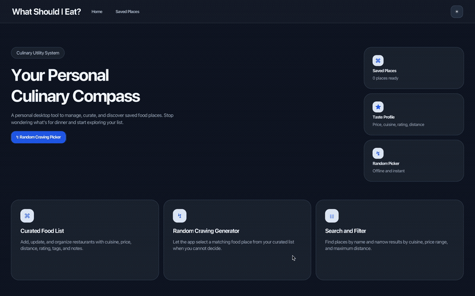
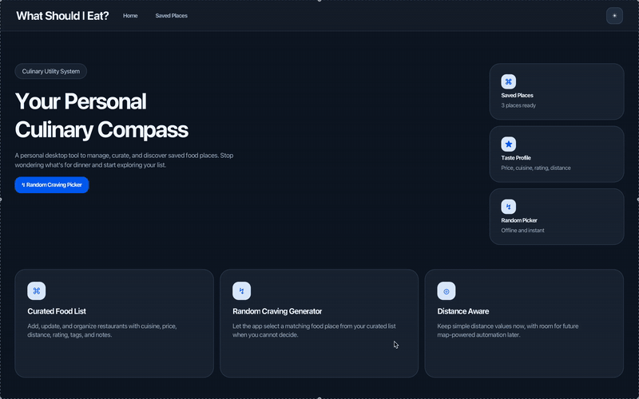
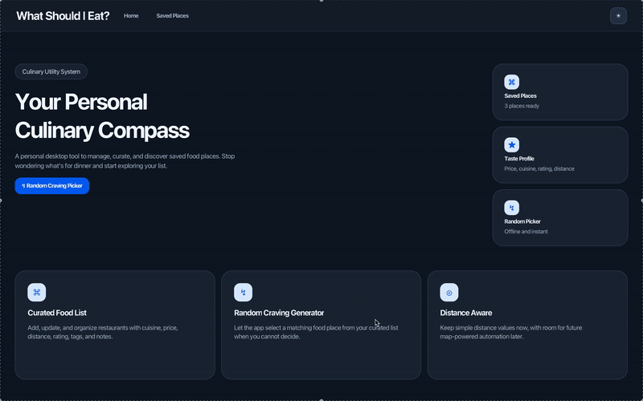

# What Should I Eat?

A Java desktop app for saving food places and randomly choosing where to eat when indecisive.

## Features

- **Manage food places:** Add, view, edit, and delete places with cuisine, price, rating, distance, tags, and personal notes.
- **Search and filter:** Find saved places by name and filter them by cuisine, price range, and maximum distance.
- **Random place picker:** Choose randomly from places matching the submitted search and active filters.
- **Local persistence:** Retain saved places and light/dark theme preferences between launches.

## Demo Workflows

### Manage Food Places



### Search and Filter



### Filtered Random Picker



## Requirements

- Windows, macOS, or Linux
- A 64-bit JDK 25
- Internet access to download the JAR and JDK

## Download and Run

Download the matching JAR from [`release/`](release) and place it in a folder for the app. On macOS or Linux, check the active JDK architecture with:

```bash
java -XshowSettings:properties -version 2>&1 | grep os.arch
```

Choose `macos-arm64` when Java reports `aarch64`, or `macos-x64` when it reports `x86_64`. Windows and Linux releases currently support x64 JDKs only. Then run:

```bash
java -jar WhatShouldIEat-<platform>.jar
```

Choose `windows-x64`, `linux-x64`, `macos-x64`, or `macos-arm64` for `<platform>`.

See [the User Guide](docs/UserGuide.md) for all features, setup details, and troubleshooting. Saved data is written to `data/places.json` when the app runs.
